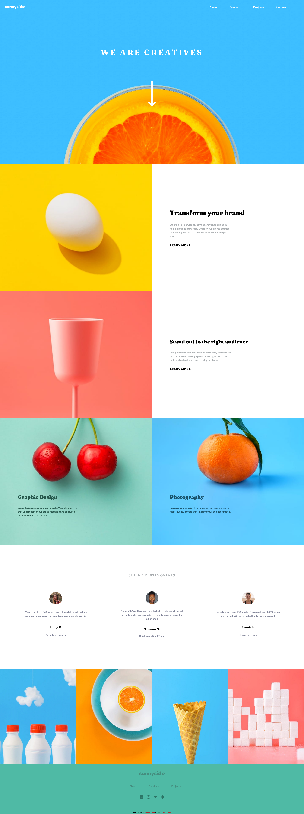

# Frontend Mentor - Sunnyside agency landing page solution

This is a solution to the [Sunnyside agency landing page challenge on Frontend Mentor](https://www.frontendmentor.io/challenges/sunnyside-agency-landing-page-7yVs3B6ef). Frontend Mentor challenges help you improve your coding skills by building realistic projects.

## Table of contents

  - [The challenge](#the-challenge)
  - [Screenshot](#screenshot)
  - [Links](#links)
  - [Built with](#built-with)
  - [What I learned](#what-i-learned)
  - [Continued development](#continued-development)
  - [Useful resources](#useful-resources)
- [Author](#author)

**Note: Delete this note and update the table of contents based on what sections you keep.**

### The challenge

Users should be able to:

- View the optimal layout for the site depending on their device's screen size
- See hover states for all interactive elements on the page

### Screenshot

### Built with

- Semantic HTML5 markup
- CSS custom properties
- Flexbox
- Grid
- Mobile-first workflow
- JavaScript

### What I learned

Im really happy with this project, is my first time using JavaScript and i know its to little the amount that is used on this project but it was actually really challenging for me
so im happy with the result. Also i manage to use a little bit of css grid wich was the only css thing i had to learn and im starting to use it little by little hahahha.

### Continued development

Really want to keep learning JavaScript and try to master my css so i can get better since i do this out of passion and i really like it.

### Useful resources

- [resource 1](https://www.w3schools.com/TAGS/tag_picture.asp) - This article really help, its something basic but i always forget this stuff haha.
- [resource 2](https://www.w3schools.com/howto/howto_css_image_text.asp) - The same for this.

## Author

- GitHub - [Yael Amallo](https://github.com/yaeltw)
- Frontend Mentor - [@yaeltw](https://www.frontendmentor.io/profile/yaeltw)

